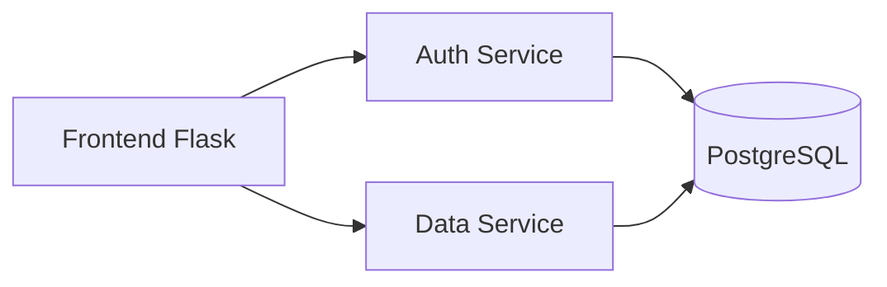

# 🎓 DEPOT

[](https://golang.org/)
[](https://python.org)
[](https://postgresql.org)
[](https://k3s.io)
[](https://podman.io)

Веб-приложение для управления данными учебной организации с микросервисной архитектурой, включая учет студентов и преподавателей, с поддержкой импорта данных из Excel.

## 🌟 Ключевые возможности
- **Микросервисная архитектура** 3 независимых сервиса
- **JWT-аутентификация**
- **Полный CRUD** для учебных сущностей (спциальности, студенты, группы и др.)
- **Импорт данных** через Excel-шаблоны
- **Автоматизированное развертывание** (Makefile + Podman)
- **Production-ready среда** на k3s (Kubernetes)
- **Автоинициализация** тестовых данных

## 🏗️ Архитектура


### Компоненты системы
1. **🔐 Auth Service (Go)**  
   Микросервис аутентификации: создание пользователей, JWT-токены, авторизация запросов.
   
2. **📊 Data Service (Go)**  
   Центральный сервис данных: REST API для работы с сущностями (студенты, группы, дисциплины и др.).
   
3. **💻 Frontend (Python/Flask)**  
   Веб-интерфейс: серверный рендеринг (Jinja2), Bootstrap, импорт из Excel.

## 🛠 Технологический стек
| Компонент          | Технологии                                                                 |
|--------------------|----------------------------------------------------------------------------|
| **Бекенд**         | Go 1.24, Python 3.11, Flask 3.1                                            |
| **База данных**    | PostgreSQL 16, GORM, Repository Design Pattern                             |
| **Инфраструктура** | Podman 5.4.2, k3s 1.32, Ansible-Playbook, Makefile, Bash скрипты           |
| **Фронтенд**       | Jinja2, Bootstrap 5                                                        |
| **Утилиты**        | uv (Python), Pydantic (Python), GORM (Go)                                               |

## ⚙️ Требования к окружению
- Podman 5.4+
- Go 1.24+
- Python 3.11+
- k3s 1.32+ (для production-развертывания)
- Make 4.4+
- uv 0.6.6+

## 🚀 Быстрый старт

### Локальная разработка
```bash
# Клонировать репозиторий
git clone https://github.com/quigon189/depot.git
cd depot

# Собрать образы и запустить проект
make build run
```

Система будет доступна по адресу: [http://localhost:5000](http://localhost:5000)  
Тестовый пользователь: `admin` / `password`

### Команды Makefile
```bash
# Основные команды:
make build    # Собрать контейнеры
make run      # Запустить проект
make stop     # Остановить и удалить контейнеры

# Для работы с k3s:
make local-registry # Развернуть локальный репозиторий
make deploy         # Собрать и запушить образы
```

## 🌐 Развертывание в k3s
1. Установите [k3s](https://docs.k3s.io/installation)
2. Запустите локальный registry:
```bash
make local-registry
```
3. Добавьте локальный репозиторий в конфиги всех нод:
```bash
# /etc/rancher/k3s/registries.conf

mirrors:
  "<ip:port локального репозитория>":
    endpoint:
      - http://<ip:port локального репозитория>
```
4. Разверните приложение:
```bash
make deploy
```
5. Замените в файлах манифеста адрес 192.168.1.14:9000 на адрес вашего registry
4. Примените манифесты:
```bash
kubectl apply -f k3s/
kubectl apply -f k3s/postgres
kubectl apply -f k3s/auth
kubectl apply -f k3s/catalog
kubectl apply -f k3s/front
```
5. Добавьте запись в hosts или DNS-сервер:
```bash
# /etc/hosts

<EXTERNAL-IP Ingress>   depot.local # подставьте внешний ip адрес ingress k3s
```

Приложение будет доступно через Ingress по адресу: `http://depot.local`

## 📂 Структура проекта
```bash
.
├── api/                  # Общие API-спецификации (находятся в редакции, могут не соответствовать)
│
├── dep-flask-front/      # Flask фронтенд
│   └── app/
│       ├── login/        # Blueprint для входа
│       ├── main/         # Blueprint для просмотра информации и шаблоно Excel
│       ├── templates/    # Jinja2 шаблоны + Bootstrap
│       ├── require/      # JWT декоратор, для проверки прав доступа
│       ├── config.py     # Кофигурации flask
│       └── Dockerfile    # Файл сборки образа flask-front
│
├── dep-go-auth/          # Сервис аутентификации (Go)
│   ├── cmd/              # Точка входа
│   ├── internal/         # Внутренние пакеты
│   │   ├── auth/         # Генерация JWT-токена
│   │   ├── config/       # Подтягивание конфигураций из config.yml
│   │   ├── repo/         # Repository Design Pattern
│   │   └── server/       # HTTP сервер
│   │     
│   ├── Dockerfile        # Файл сборки образ go-auth
│   └── config.yml        # Конфигурации go-auth
│
├── dep-go-catalog/       # Сервис данных (Go)
│   ├── cmd/              # Точка входа
│   ├── internal/         # Бизнес-логика
│   │   ├── config/       # Подтягивание конфигураций
│   │   ├── database/     # Подключение к БД, миграции
│   │   ├── handlers/     # Endpoints для взаимодействия с данными
│   │   ├── http/         # HTTP сервер
│   │   ├── models/       # Модели данных (GORM)
│   │   └── services/     # Бизнес-логика
│   │     
│   ├── pkg/              # Вспомогательные пакеты
│   │   └── ymlconfig/    # Парсинг config.yml с чтением ENV переменных
│   │     
│   ├── Dockerfile        # Файл сборки образ go-catalog
│   └── config.yml        # Конфигурации go-catalog
│
├── k3s/                  # Production среда (k3s)
│   ├── auth/             # Манифесты аутентификации
│   ├── catalog/          # Манифесты сервиса данных
│   ├── front/            # Манифесты фронтенда
│   └── postgres/         # Конфигурация БД
│
├── logs/                 # Логи приложения
├── scripts/              # Вспомогательные скрипты
│   ├── run.sh            # Запуск среды разработчика, используя podman-compose
│   └── test-data.sh      # Добавление тестовых данных
│
├── Makefile              # Управление жизненным циклом
├── project_config.mk     # Основные конфигурации всего проекта
└── compose.yml           # Конфигурация контейнеров
```

## 📚 Документация API

### Сервис аутентификации
| Метод | Эндпоинт       | Описание                |
|-------|----------------|-------------------------|
| POST  | /auth/login    | Авторизация (JWT токен) |
| POST  | /auth/add      | Добавление пользователя |

### Сервис данных
```markdown
GET    /specialties/{id}    # Информация о специальности
GET    /specialties/all     # Информация о всех специальностях
POST   /specialties         # Добавления списка специальностей
PUT    /specialties         # Изменение специальности
DELETE /specialties         # Удаление специальности
...    ...                  # Аналогично для других сущностей
```

## 🖼️ Скриншоты системы
|     |  |
|------------------------------------------|-------------------------------------------------------|
| **Авторизация пользователя**             | **Управление специальностями**                        |

|         |                  |
|------------------------------------------|-------------------------------------------------------|
| **Форма импорта данных из Excel**        | **Скачевание шаблонов**                               |

## 📈 Планы развития
- [ ] Добавление ролевой модели пользователей
- [ ] Добавление модуля администрирования пользователей
- [ ] Добавление модуля формирования расписания
- [ ] Внедрение CI/CD через GitHub Actions
- [ ] Реализация уведомлений об изменениях (Telegram/Email)
- [ ] Синхронизация расписаия с Google Календарь
- [ ] Интеграция Prometheus + Grafana для мониторинга
- [ ] Поддержка мобильного приложения через REST API

---
**Разработано для автоматизации учебных процессов**  
[GitHub Repo](https://github.com/quigon189/depot)
